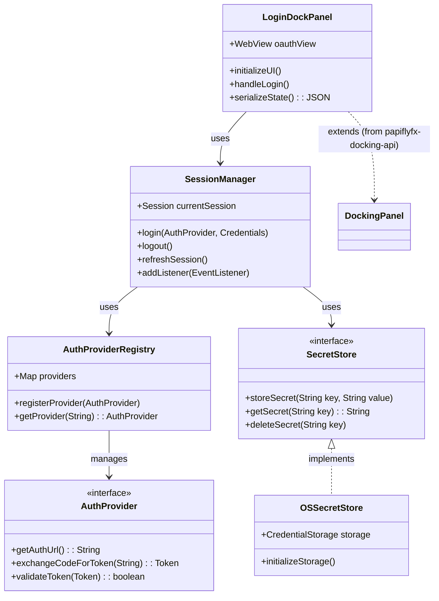
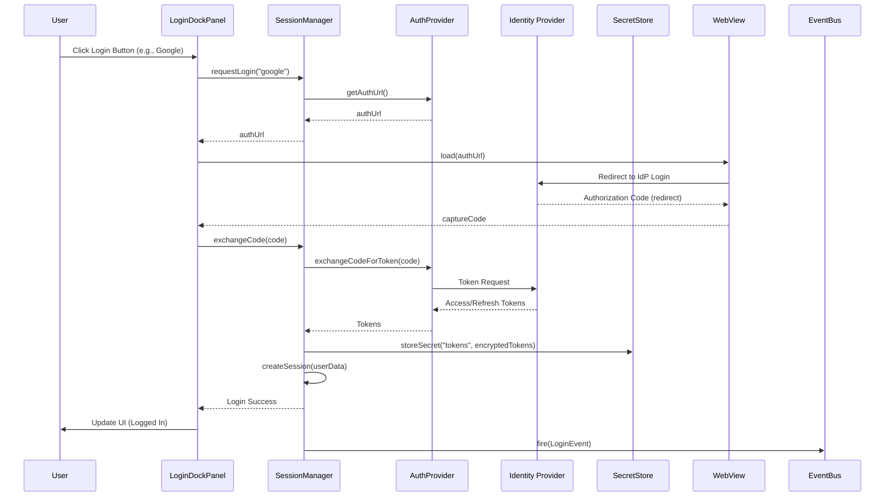

# login-grok

# PapiflyFX Docking Login Component Specification

## Introduction

This document outlines the concept and specification for a new module in the PapiflyFX Docking Framework: `papiflyfx-docking-login`. This module introduces a login docking component designed to provide secure authentication capabilities within docking-based JavaFX applications. It integrates seamlessly with the core docking framework (`papiflyfx-docking-docks`) by implementing the shared interfaces from `papiflyfx-docking-api`.

The login component serves as a dockable panel that handles user authentication prompts, supports multiple identity providers (IdPs) via OAuth 2.0/OpenID Connect flows, manages user sessions, and ensures secure handling of session secrets. This enables developers to build applications with authentication requirements, such as IDEs, dashboards, or enterprise tools, where users can dock/undock the login panel as needed.

The component is inspired by modern authentication patterns (e.g., single sign-on) and prioritizes security, modularity, and extensibility to align with the PapiflyFX framework's philosophy of composable UI building blocks.

## Key Features

- **Docking Framework Application Login Prompt**:
    - A dockable panel that displays a login interface, including username/password fields (for custom auth) and buttons for external IdPs.
    - Supports drag-and-drop positioning, floating windows, tab grouping, and minimize/maximize, inheriting from the core docking engine.
    - Configurable to appear automatically on application startup if no active session exists, or as a manual dockable tool.

- **Support for Multiple Identity Providers**:
    - Integration with popular IdPs such as Google, Facebook, GitHub, Apple, Amazon Cognito, and others.
    - OAuth 2.0/OpenID Connect flows using embedded WebView for authorization code grants.
    - Extensible provider registry: Developers can add custom IdPs via configuration or plugins.
    - Fallback to custom authentication (e.g., local database or API-based login).

- **Session Management**:
    - Tracks user sessions, including login state, user profile data (e.g., name, email, roles).
    - Automatic session refresh and expiration handling.
    - Integration with the framework's JSON session persistence: Non-sensitive session metadata (e.g., login status, user ID) can be serialized to JSON for layout restoration.
    - Event-driven notifications: Fires events on login/logout for other components to react (e.g., enabling/disabling docks based on auth).

- **Session Secret Management**:
    - Secure storage of sensitive data like access tokens, refresh tokens, and API keys using OS secret management services (e.g., Windows Credential Manager, macOS Keychain, Linux GNOME Keyring/Libsecret).
    - Avoidance of plain-text storage: Secrets are never persisted in JSON or logs.
    - Encryption for in-memory secrets using libraries like Bouncy Castle.
    - Support for external secret managers (e.g., HashiCorp Vault) via optional extensions.

## Architecture

### High-Level Design

The `papiflyfx-docking-login` module will depend on `papiflyfx-docking-api` and `papiflyfx-docking-docks`. It introduces the following key classes/interfaces:

- **LoginDockPanel**: Extends/implements the docking panel interface from the API. This is the UI component rendered in the docking layout.
    - Contains a JavaFX `WebView` for OAuth flows and custom UI elements (buttons, forms).
    - Handles layout persistence by serializing non-sensitive state (e.g., panel position, logged-in user display name).

- **AuthProviderRegistry**: A registry for managing IdPs. Each provider is configured with client ID, secret, authorization URI, token URI, etc.
    - Built-in providers: Google, Facebook, GitHub, Apple, Amazon.
    - Extension point: `AuthProvider` interface for custom implementations.

- **SessionManager**: Singleton or service for managing sessions.
    - Stores session data in memory with secure wrappers for secrets.
    - Integrates with JavaFX application lifecycle for auto-login on startup (if refresh token available).
    - Event bus integration: Publishes `LoginEvent`, `LogoutEvent`, `SessionExpiredEvent`.

- **SecretStore**: Abstraction for secure storage.
    - Default implementation: Using OS secret management services via a cross-platform library (e.g., microsoft/credential-secure-storage-for-java).
    - Optional: Integration with external services via dependencies (e.g., Vault API).

### Integration with PapiflyFX Core

- **Docking Registration**: The login panel registers with the core docking engine using the API's panel factory or registry.
- **Persistence**: Overrides serialization hooks to exclude secrets from JSON output. Only panel metadata and non-sensitive session info are persisted.
- **UI Customization**: Themes and styles align with the framework's CSS or theming system.
- **Dependencies**: Minimal external libs (e.g., Apache HttpClient for OAuth, JSON for config). Avoid heavy frameworks to keep it lightweight.

### Security Considerations

- All OAuth flows use HTTPS and validate tokens against IdP's JWKS (JSON Web Key Set).
- Input validation to prevent injection attacks in custom login forms.
- No storage of passwords; rely on token-based auth.
- Compliance: Aim for OAuth 2.1 best practices, GDPR-friendly data handling.

## UML Diagrams

The following UML diagrams illustrate the key aspects of the login component's architecture. They are provided in Mermaid syntax for easy rendering in Markdown viewers like GitHub.

### Class Diagram

This diagram shows the main classes, interfaces, and their relationships.

### Sequence Diagram: OAuth Login Flow

This diagram depicts the sequence of interactions during a typical OAuth login process.

## Implementation Plan

### Phase 1: Core Login Panel (1-2 weeks)
- Implement `LoginDockPanel` with basic UI (buttons for IdPs, custom form).
- Integrate with docking API for drag-drop and persistence.
- Add demo in `papiflyfx-docking-samples` showing the login panel in action.

### Phase 2: OAuth Integration (2-3 weeks)
- Develop `AuthProviderRegistry` with 3-5 built-in providers (Google, GitHub, Facebook).
- Embed `WebView` for auth flows, handle redirects and token exchange.
- Test end-to-end login/logout.

### Phase 3: Session and Secret Management (1-2 weeks)
- Build `SessionManager` with event handling.
- Implement `SecretStore` using OS secret management services (e.g., via microsoft/credential-secure-storage-for-java library).
- Ensure secrets are not leaked in persistence or logs.

### Phase 4: Extensibility and Polish (1 week)
- Add configuration options (e.g., via JSON/YAML files for IdP setup).
- Documentation: Update repo README, add usage examples.
- Testing: Unit tests for auth flows, integration tests with docking core.

### Dependencies and Tools
- JavaFX 17+ (aligned with framework).
- External libs: `org.apache.httpcomponents:httpclient` for HTTP, `com.nimbusds:oauth2-oidc-sdk` for OAuth handling, `com.microsoft:credential-secure-storage` for OS secret management.
- Build: Maven module, similar to existing structure.

## Potential Challenges and Mitigations

- **WebView Security**: Mitigate by sandboxing and restricting navigation.
- **Cross-Platform Secret Storage**: Use a cross-platform library like microsoft/credential-secure-storage-for-java; provide fallbacks (e.g., file-based encrypted store) if OS services are unavailable.
- **IdP Configuration**: Require users to provide client secrets securely (e.g., via environment vars).
- **Performance**: Ensure auth flows don't block UI thread; use async tasks.

## Future Enhancements

- Multi-factor authentication (MFA) support.
- Role-based access control (RBAC) integration.
- Biometric login (e.g., fingerprint via platform APIs).
- Analytics: Track login attempts without compromising privacy.

This specification provides a foundation for developing the login component. Contributions and feedback are welcome to refine it further.