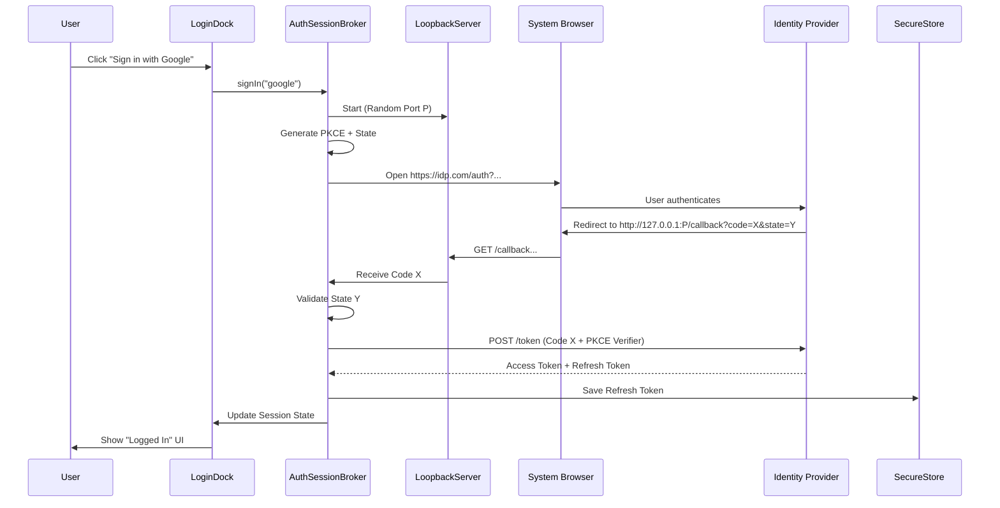

# Implementation Plan: PapiflyFX Docking Login

This document outlines the detailed implementation plan for `papiflyfx-docking-login`, a component providing secure, dockable authentication for PapiflyFX applications. It synthesizes architectural patterns from various analyses to ensure a robust, secure, and user-friendly experience.

## 1. Overview

The `papiflyfx-docking-login` module serves as the **Authentication & Session Layer** for the docking framework. It provides a dedicated UI node (`LoginDock`) for user sign-in and a headless service layer (`AuthSessionBroker`) for managing OAuth 2.0/OIDC sessions, token lifecycles, and secure storage.

### Key Goals
- **Dockable UI**: A login panel that behaves like any other dock (drag, float, minimize).
- **System Browser Auth**: Use the OS default browser for security (RFC 8252), avoiding embedded WebViews for credentials.
- **Pluggable Providers**: Architecture supports Google, GitHub, generic OIDC, etc.
- **Native Security**: Secrets (refresh tokens) stored in OS Keychains (macOS Keychain, Windows Credential Manager, Linux Secret Service).
- **Session State**: Reactive state management (Logged In, Expired, Refreshing) integrated with JavaFX properties.

## 2. Module Structure

**Maven Module**: `papiflyfx-docking-login`
**Package Root**: `org.metalib.papifly.fx.login`

```text
org.metalib.papifly.fx.login
├── api
│   ├── AuthSession.java           // Session data model
│   ├── AuthSessionBroker.java     // Primary service interface
│   ├── IdentityProvider.java      // SPI for auth providers
│   └── SecureTokenStore.java      // SPI for secret storage
├── core
│   ├── DefaultAuthSessionBroker.java
│   ├── LoopbackServer.java        // Ephemeral HTTP server for callbacks
│   └── PkceUtil.java             // PKCE challenge generation
├── providers
│   ├── GoogleProvider.java
│   ├── GitHubProvider.java
│   └── GenericOidcProvider.java
└── ui
    ├── LoginDock.java             // Main DockNode implementation
    └── LoginView.java             // JavaFX internal view (Provider list, QR codes)
```

## 3. Architecture & Components

### 3.1 Visual State Machine

The `LoginDock` UI transitions through the following states (concept adapted from Gemini analysis):

| State | UI Representation | Underlying Action |
| :--- | :--- | :--- |
| **Idle** | List of Provider Buttons (Google, GitHub) | Waiting for user input. |
| **Initiating** | Spinner on selected button | Generating PKCE verifier, State, Nonce. |
| **External Wait** | "Check your browser..." | System browser opened; Loopback server listening. |
| **Polling** | "Waiting for device..." | (Device Flow only) Polling token endpoint. |
| **Exchanging** | Indeterminate progress | Exchanging Auth Code for Tokens. |
| **Authenticated** | User Profile / Logout Button | Session active; Tokens stored securely. |
| **Failure** | Error message + Retry | Timeout or validation failure. |

### 3.2 Data Models

**AuthSession**
```java
public record AuthSession(
    String providerId,
    String subject,        // Unique user ID
    String displayName,
    String email,
    String avatarUrl,
    Instant expiresAt,
    Set<String> scopes
    // Note: Tokens are NOT in the public record to avoid accidental logging
) {}
```

**AuthState Enum**
```java
public enum AuthState {
    UNAUTHENTICATED,
    AUTHENTICATING,
    AUTHENTICATED,
    EXPIRED_REFRESHABLE, // Token expired, but we have a refresh token
    EXPIRED_HARD         // Login required
}
```

## 4. API Design

### 4.1 AuthSessionBroker (Service Layer)

The main entry point for the application.

```java
public interface AuthSessionBroker {
    // Reactive state for UI binding
    ReadOnlyObjectProperty<AuthState> authStateProperty();
    ReadOnlyObjectProperty<AuthSession> sessionProperty();

    // Actions
    CompletableFuture<AuthSession> signIn(String providerId);
    CompletableFuture<Void> signOut();
    
    // Lifecycle
    CompletableFuture<AuthSession> refreshSession(); // Silent refresh
    void dispose(); // Clean up loopback servers
}
```

### 4.2 IdentityProvider (SPI)

Adapters for specific services (Google, GitHub, Apple).

```java
public interface IdentityProvider {
    String getId();           // e.g., "google"
    String getDisplayName();  // e.g., "Google"
    Node getIcon();           // JavaFX icon node

    boolean supportsDeviceFlow();
    
    // Auth Code Flow Construction
    AuthorizationRequest buildAuthRequest(URI redirectUri, String state, String pkceChallenge);
    
    // Token Exchange
    TokenResponse exchangeCode(String code, String pkceVerifier, URI redirectUri);
    
    // User Info Fetch
    UserProfile fetchUserProfile(String accessToken);
}
```

### 4.3 SecureTokenStore (SPI)

Abstracts OS-specific secret storage.

```java
public interface SecureTokenStore {
    void save(String key, String secret);
    Optional<String> load(String key);
    void delete(String key);
}
```

## 5. Security Strategy

1.  **PKCE (RFC 7636)**: Mandatory for all flows.
    - `Code Verifier`: High-entropy random string.
    - `Code Challenge`: BASE64URL-ENCODE(SHA256(ASCII(Code Verifier))).
2.  **Loopback Redirect**:
    - Bind to `127.0.0.1` on port `0` (random ephemeral).
    - Validate `state` parameter on callback to prevent CSRF.
3.  **Secret Storage**:
    - Use JNA (Java Native Access) to interface with:
        - macOS: Keychain Services
        - Windows: Credential Manager
        - Linux: libsecret / GNOME Keyring
    - **Fallback**: Encrypted file (AES-256) with user-provided master password (only if native fails).

## 6. Authentication Flows

### 6.1 Standard Browser Flow (Authorization Code)



### 6.2 GitHub Device Flow (Optional)

Useful for environments where browser callback is difficult.

1.  App requests `device_code` from GitHub.
2.  App displays `user_code` (e.g., "ABCD-1234") and URL to User.
3.  App polls GitHub token endpoint every X seconds.
4.  User enters code on phone/desktop browser.
5.  GitHub responds with Tokens to polling request.

## 7. Implementation Steps

### Phase 1: Core Architecture & UI Skeleton
- Create module structure and interfaces.
- Implement `LoginDock` UI with placeholder buttons.
- Implement `LoopbackServer` using `com.sun.net.httpserver` or standard `ServerSocket`.

### Phase 2: Generic OIDC Provider
- Implement `GenericOidcProvider`.
- Implement PKCE generation logic.
- Connect `AuthSessionBroker` to perform the Browser redirect loop.
- **Deliverable**: Working login with a standard OIDC provider (e.g., Auth0 or Keycloak test instance).

### Phase 3: Secure Storage & Persistence
- Integrate JNA libraries for Keychain access.
- Implement `SecureTokenStore`.
- Implement Session restoration on app startup (reading Refresh Token -> getting new Access Token).

### Phase 4: Provider Polish
- Add specialized `GoogleProvider` and `GitHubProvider` (including Device Flow support).
- Add specific icons and branding colors.
- Polish `LoginDock` states (loading spinners, error messages).

## 8. Code Snippet: Loopback Server Concept

```java
// Simplified concept for the temporary callback server
public class LoopbackServer {
    public CompletableFuture<String> listen() {
        CompletableFuture<String> future = new CompletableFuture<>();
        try {
            HttpServer server = HttpServer.create(new InetSocketAddress("127.0.0.1", 0), 0);
            int port = server.getAddress().getPort();
            
            server.createContext("/callback", exchange -> {
                String query = exchange.getRequestURI().getQuery();
                // Parse 'code' and 'state' from query
                // Validate state...
                
                String response = "<h1>Login Complete</h1><p>You can close this window.</p>";
                exchange.sendResponseHeaders(200, response.length());
                exchange.getResponseBody().write(response.getBytes());
                exchange.close();
                server.stop(0);
                
                future.complete(parsedCode);
            });
            
            server.start();
            System.out.println("Listening on port " + port);
            return future;
        } catch (Exception e) {
            future.completeExceptionally(e);
            return future;
        }
    }
}
```

## 9. Dependencies

- **Networking**: Java 11+ `HttpClient`.
- **JSON**: `Jackson` or `Gson` (align with parent project).
- **Security**: `JNA` (for Keychain access).
- **UI**: JavaFX (standard).

---
*Plan generated by merging insights from ChatGPT, Gemini, and Grok analysis documents.*
