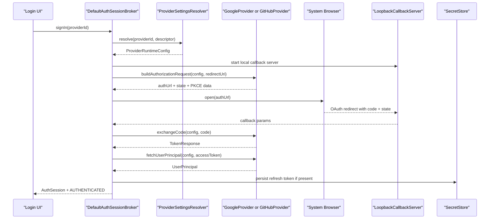
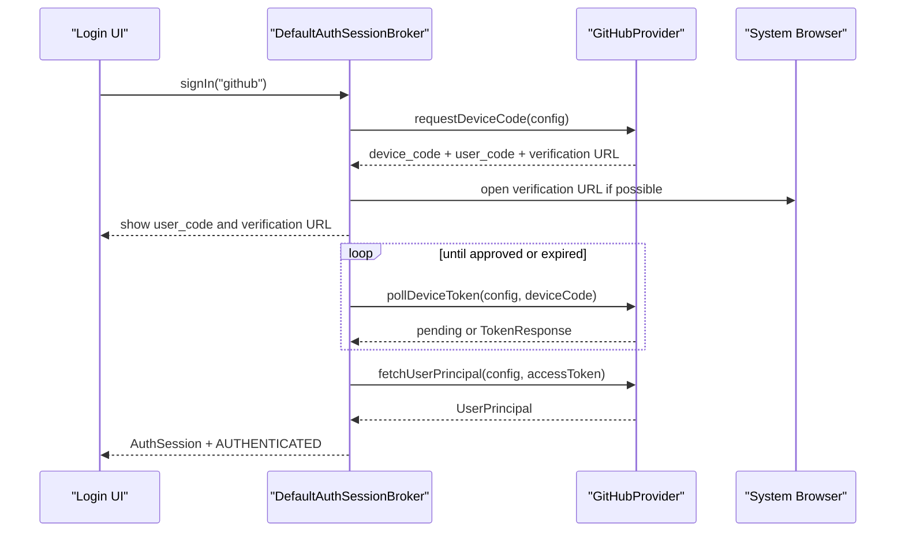

# Review1: Google and GitHub Provider Interaction

Date: 2026-03-30
Status: initial draft
Scope: `papiflyfx-docking-login-idapi`, `papiflyfx-docking-login-session-api`, `papiflyfx-docking-login`

## 1. Purpose

This document explains how Google and GitHub identity providers currently work as pluggable features inside the PapiflyFX docking login framework.

The main point is:

- Google and GitHub are peer providers behind the same `IdentityProvider` SPI.
- They do not directly authenticate against each other and they do not exchange tokens.
- Their interaction happens through shared framework services:
  - provider discovery
  - settings resolution
  - broker-controlled sign-in
  - shared session state
  - shared secret persistence

This review is implementation-based, not a greenfield proposal.

## 2. Confirmed Implementation Baseline

The current runtime already contains the pluggable login split described in `plan1.md`:

- `papiflyfx-docking-login-idapi`
  - provider SPI
  - provider registry
  - PKCE and callback helpers
  - built-in `GenericOidcProvider`, `GoogleProvider`, `GitHubProvider`
- `papiflyfx-docking-login-session-api`
  - session model (`AuthSession`, `AuthState`)
  - session/secret store abstractions
- `papiflyfx-docking-login`
  - `DefaultAuthSessionBroker`
  - docking/UI integration
  - settings integration
  - runtime bootstrap

Built-in providers are registered through `ServiceLoader`, so Google and GitHub are discovered as plugins rather than hard-wired inside the UI.

## 3. Architectural Position of Google and GitHub

### 3.1 Shared contracts

Both providers implement the same SPI:

- `IdentityProvider.descriptor()`
- `buildAuthorizationRequest(...)`
- `exchangeCode(...)`
- `fetchUserPrincipal(...)`
- optional `refreshToken(...)`
- optional `requestDeviceCode(...)`
- optional `pollDeviceToken(...)`
- optional `revokeToken(...)`

Both are exposed to the rest of the framework only through:

- `ProviderDescriptor`
- `ProviderCapabilities`
- `ProviderConfig`

This keeps the broker and UI provider-agnostic.

### 3.2 Runtime participants

| Component | Responsibility in the Google/GitHub interaction |
| --- | --- |
| `ProviderRegistry` | Discovers and stores available provider plugins. |
| `LoginRuntime` | Creates the shared runtime registry and broker. |
| `ProviderSelectionView` | Shows available provider buttons using provider descriptors. |
| `AuthenticationCategory` | Captures provider-specific configuration from settings. |
| `ProviderSettingsResolver` | Converts settings into provider-specific `ProviderConfig`. |
| `DefaultAuthSessionBroker` | Chooses the flow, executes the flow, persists session state, refreshes, logs out. |
| `SecretStore` | Stores refresh tokens and client secrets. |
| `SettingsStorage` | Stores non-secret provider configuration and session metadata. |

## 4. Provider Interaction Model

### 4.1 There is no direct Google-to-GitHub federation

The current implementation does not support:

- using a Google identity to obtain a GitHub identity
- linking Google and GitHub accounts into one logical principal
- exchanging a Google token for a GitHub token
- selecting multiple providers inside one sign-in transaction

Instead, the model is:

1. A user chooses one provider.
2. The broker executes that provider's flow.
3. The resulting session is stored under that provider's namespace.
4. Another provider can later create another session in the same runtime.
5. The runtime can switch the active session, but it does not merge them.

### 4.2 Shared session map, isolated provider state

`DefaultAuthSessionBroker` stores sessions in a map keyed by:

```text
<providerId>:<subject>
```

This means:

- a Google account and a GitHub account can coexist in memory
- each session remains provider-scoped
- refresh tokens are also provider-scoped through secret keys such as:

```text
login:oauth:refresh:google:<subject>
login:oauth:refresh:github:<subject>
```

This is the actual interaction boundary between the two providers: shared lifecycle infrastructure, isolated credentials.

## 5. End-to-End Flow

### 5.1 Common authorization-code path

Both Google and GitHub support the authorization-code flow with PKCE.



### 5.2 GitHub device-flow branch

GitHub adds a second path that Google does not currently support:



The broker prefers the GitHub device flow when:

- the resolved provider setting requests `flow=device`, or
- the GitHub client secret is blank

That preference is implemented in `ProviderSettingsResolver`, then enforced in `DefaultAuthSessionBroker`.

## 6. Google vs GitHub: Current Behavioral Differences

| Topic | Google | GitHub |
| --- | --- | --- |
| Provider class | `GoogleProvider extends GenericOidcProvider` | `GitHubProvider extends GenericOidcProvider` |
| Protocol shape | OIDC-style user info and refresh support | OAuth with GitHub `/user` API, optional device flow |
| Default scopes | `openid email profile` | `repo read:user` |
| ID token expectation | `providesOidcIdToken = true` | `providesOidcIdToken = false` |
| Device flow | Not supported | Supported |
| Enterprise host support | No provider-specific host override | GitHub Enterprise URL supported |
| Special auth parameters | `access_type=offline` | none by default |
| Special retry behavior in broker | one-time consent retry when refresh token is missing | none |
| Additional validation | optional workspace-domain check after login | none beyond normal token/user fetch |

## 7. Provider-Specific Logic That Affects Cross-Provider Consistency

### 7.1 Google-specific behavior

Google is treated as a refreshable long-lived session provider.

Current implementation details:

- `ProviderSettingsResolver.googleConfig(...)` injects `access_type=offline`.
- `DefaultAuthSessionBroker` checks whether Google returned a refresh token.
- If not, and no stored Google refresh token exists for that subject, the broker retries once with:

```text
prompt=consent
```

- If the second attempt still has no refresh token, the broker fails the sign-in.
- If `Google Workspace Domain` is configured, the broker validates the signed-in email domain after principal fetch.

Important consequence:

- Google has stricter refresh-token expectations than GitHub in the current broker logic.

### 7.2 GitHub-specific behavior

GitHub is treated as a provider with two viable login modes:

- authorization code + PKCE
- device flow

Current implementation details:

- `GitHubProvider` resolves public GitHub and GitHub Enterprise endpoints.
- user identity is read from `/user`, not from an OIDC userinfo endpoint
- device authorization is supported through:
  - `/login/device/code`
  - token polling against `/login/oauth/access_token`
- `GitHubProvider` reports `supportsDeviceFlow = true`
- the broker can enter `AuthState.POLLING_DEVICE`

Important consequence:

- GitHub is the more operationally flexible provider today, especially for non-browser-friendly environments.

## 8. Settings and Secret Boundaries

The shared settings model is a major part of the provider interaction.

### 8.1 Shared non-secret settings

Settings are stored by provider namespace:

- `login.provider.google.enabled`
- `login.provider.google.clientId`
- `login.provider.google.scopes`
- `login.provider.google.workspaceDomain`
- `login.provider.github.enabled`
- `login.provider.github.clientId`
- `login.provider.github.scopes`
- `login.provider.github.enterpriseUrl`

### 8.2 Shared secret model

Client secrets and refresh tokens are separated from normal settings:

- provider client secret:

```text
login:provider:client-secret:<provider>
```

- session refresh token:

```text
login:oauth:refresh:<providerId>:<subject>
```

This design allows Google and GitHub to share the same storage mechanism without sharing actual credentials.

## 9. Pluggability Story

The current Google/GitHub implementation demonstrates the intended extension model for future providers.

To add another identity provider, the framework currently expects:

1. Implement `IdentityProvider`.
2. Return a `ProviderDescriptor` with stable `providerId`, display name, scopes, and capability flags.
3. Support the required flow methods for that provider.
4. Register the implementation through `META-INF/services/...IdentityProvider`.
5. Add provider-specific settings resolution if the provider needs custom configuration.
6. Optionally extend the settings UI with provider-specific fields.

Google and GitHub show two different plugin shapes:

- Google = OIDC-oriented provider with broker-managed refresh-token policy
- GitHub = OAuth provider with a provider-specific device-flow path and enterprise endpoint support

That makes them good reference implementations for future providers such as Microsoft, Okta, Apple, or GitLab.

## 10. Current Gaps and Questions for the Next Revision

These are the main design questions still worth documenting before the spec is finalized.

### 10.1 Account linking

Should the framework eventually support:

- one logical user linked to both Google and GitHub
- provider-to-provider account association
- a unified account chooser above provider-specific sessions

Current answer: no. The implementation is multi-session, not linked-identity.

### 10.2 Provider-specific settings completeness

`ProviderSettingsResolver` supports a GitHub flow preference (`flow=device`), but the current `AuthenticationCategory` UI does not expose that option directly.

Question:

- should GitHub flow mode become a first-class settings field?

### 10.3 Domain restriction UX for Google

Current Google domain restriction is enforced after authentication by inspecting the fetched email.

Questions:

- should the framework also send a Google hosted-domain hint during authorization?
- should domain mismatch be represented as a dedicated auth error code instead of a generic exception?

### 10.4 Session presentation

The broker can hold multiple sessions across providers, but the UI still behaves mostly like a single active-session view.

Questions:

- should the login dock become an account switcher across Google and GitHub sessions?
- should provider badges and session inventory be more prominent in the dock UI?

## 11. Recommended Direction

For the next iteration of this spec, the most useful refinement would be:

1. Keep the provider SPI and shared broker model as the core architecture.
2. Explicitly document that Google and GitHub are sibling plugins, not federated providers.
3. Add a formal multi-account model describing how sessions from different providers coexist.
4. Decide whether GitHub device-flow preference belongs in the settings UI.
5. Decide whether cross-provider account linking is a future goal or an explicit non-goal.

## 12. Summary

Google and GitHub already behave as real pluggable identity providers in the framework.

Their interaction is indirect and deliberate:

- common SPI
- common discovery
- common broker
- common settings/secret infrastructure
- separate provider semantics
- separate provider credentials
- shared session runtime with provider-qualified identities

That is a solid base for the login module. The next specification step should focus less on basic pluggability and more on multi-provider session UX, provider-specific configuration completeness, and whether linked identities are part of the product direction.
