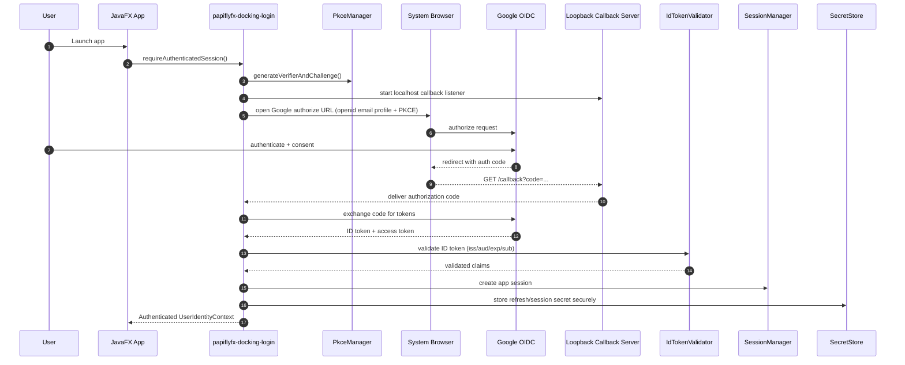
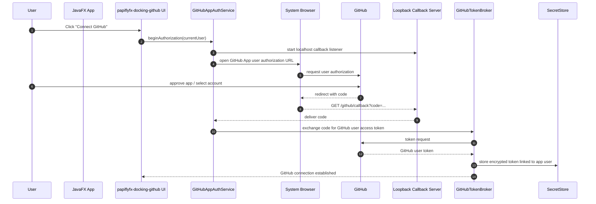
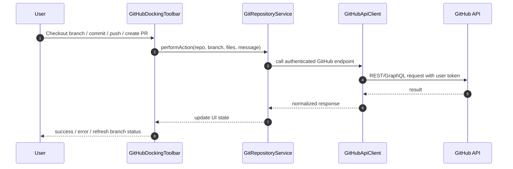

Below is a practical design for integrating `papiflyfx-docking-login` with `papiflyfx-docking-github`.

**Recommended pattern:** use **Google OIDC** for sign-in, and use a **GitHub App** for GitHub operations. GitHub’s own docs say GitHub Apps are generally preferred over OAuth apps because they use fine-grained permissions and short-lived tokens. Google OIDC is appropriate for proving user identity in a desktop app, and Google recommends PKCE for native/desktop OAuth flows. ([GitHub Docs][1])

## 1) Target architecture

```text
papiflyfx-docking-login
 ├─ GoogleOIDCProvider
 ├─ AuthBrowserLauncher
 ├─ LoopbackCallbackServer
 ├─ PkceManager
 ├─ IdTokenValidator
 ├─ SessionManager
 ├─ SecretStore
 └─ UserIdentityContext

papiflyfx-docking-github
 ├─ GitHubConnectionController
 ├─ GitHubAppAuthService
 ├─ GitHubTokenBroker
 ├─ GitHubApiClient
 ├─ GitRepositoryService
 ├─ BranchService
 ├─ CommitService
 ├─ PullRequestService
 └─ GitHubDockingToolbar
```

### Responsibility split

`papiflyfx-docking-login`

* authenticates the user with Google
* validates the Google ID token
* creates the local app session
* stores session secrets securely
* exposes the current authenticated user to other docking modules

`papiflyfx-docking-github`

* lets the signed-in user connect a GitHub account
* performs GitHub authorization
* obtains GitHub user token through a GitHub App flow
* performs repo/branch/commit/push/PR actions
* renders GitHub-specific UI in a docking toolbar

That split follows the protocol boundaries: Google provides identity, while GitHub provides authorization to GitHub resources. GitHub does not accept Google tokens for GitHub API access. ([Google for Developers][2])

---

## 2) End-to-end sequence diagram

### A. App sign-in with Google OIDC



Google documents OIDC for authentication and desktop/native OAuth flows, and recommends PKCE for native apps. ([Google for Developers][2])

### B. Connect GitHub account and get a GitHub user token



GitHub says GitHub Apps are generally preferred over OAuth apps, and user access tokens for GitHub Apps are OAuth tokens with fine-grained permissions. ([GitHub Docs][1])

### C. Modify a repository



GitHub user tokens are meant to be sent in the `Authorization` header for subsequent API requests. ([GitHub Docs][3])

---

## 3) Java module structure

A clean JPMS layout could look like this:

### `papiflyfx-docking-login`

```java
module papiflyfx.docking.login {
    requires javafx.controls;
    requires javafx.graphics;
    requires java.net.http;
    requires java.desktop;
    requires java.sql;
    requires com.fasterxml.jackson.databind;

    exports org.metalib.papiflyfx.docking.login.api;
    exports org.metalib.papiflyfx.docking.login.model;

    uses org.metalib.papiflyfx.docking.login.api.IdentityProvider;
    uses org.metalib.papiflyfx.docking.login.api.SecretStore;
}
```

### `papiflyfx-docking-github`

```java
module papiflyfx.docking.github {
    requires javafx.controls;
    requires javafx.graphics;
    requires java.net.http;
    requires java.desktop;
    requires com.fasterxml.jackson.databind;

    requires papiflyfx.docking.login;

    exports org.metalib.papiflyfx.docking.github.api;
    exports org.metalib.papiflyfx.docking.github.model;

    uses org.metalib.papiflyfx.docking.login.api.SessionManager;
    uses org.metalib.papiflyfx.docking.github.api.GitHubProvider;
}
```

---

## 4) Core interfaces

### Login module API

```java
public interface IdentityProvider {
    AuthResult authenticate(AuthRequest request) throws AuthException;
    void signOut() throws AuthException;
    boolean supportsRefresh();
    TokenSet refresh(TokenSet current) throws AuthException;
}

public interface SessionManager {
    Optional<UserSession> currentSession();
    UserSession requireSession();
    void saveSession(UserSession session);
    void clearSession();
}

public interface SecretStore {
    void put(String key, byte[] secret) throws SecretStoreException;
    Optional<byte[]> get(String key) throws SecretStoreException;
    void remove(String key) throws SecretStoreException;
}
```

### GitHub module API

```java
public interface GitHubProvider {
    GitHubConnection connect(UserSession session) throws GitHubAuthException;
    void disconnect(String accountId) throws GitHubAuthException;
    List<RepositoryRef> listRepositories(GitHubConnection connection) throws GitHubApiException;
}

public interface GitRepositoryService {
    BranchRef checkoutBranch(RepoContext repo, String branchName) throws GitHubApiException;
    BranchRef createBranch(RepoContext repo, String newBranch, String fromBranch) throws GitHubApiException;
    CommitResult commitChanges(RepoContext repo, CommitRequest request) throws GitHubApiException;
    PushResult push(RepoContext repo, String branchName) throws GitHubApiException;
    PullRequestRef createPullRequest(RepoContext repo, PullRequestRequest request) throws GitHubApiException;
}
```

---

## 5) Recommended package layout

### `papiflyfx-docking-login`

```text
org.metalib.papiflyfx.docking.login
├─ api
│  ├─ IdentityProvider.java
│  ├─ SessionManager.java
│  ├─ SecretStore.java
│  └─ AuthEventListener.java
├─ google
│  ├─ GoogleOidcProvider.java
│  ├─ GoogleDiscoveryClient.java
│  ├─ GoogleTokenClient.java
│  └─ GoogleUserInfoClient.java
├─ internal.pkce
│  ├─ PkceManager.java
│  └─ StateNonceManager.java
├─ internal.callback
│  ├─ LoopbackCallbackServer.java
│  └─ CallbackRequestHandler.java
├─ internal.validation
│  ├─ IdTokenValidator.java
│  └─ JwtKeySetResolver.java
├─ internal.session
│  ├─ DefaultSessionManager.java
│  ├─ UserSession.java
│  └─ UserIdentityContext.java
├─ internal.secret
│  ├─ OsKeychainSecretStore.java
│  └─ EncryptedFileFallbackSecretStore.java
└─ ui
   ├─ LoginDockNode.java
   ├─ LoginToolbarItem.java
   └─ SignInDialogController.java
```

### `papiflyfx-docking-github`

```text
org.metalib.papiflyfx.docking.github
├─ api
│  ├─ GitHubProvider.java
│  ├─ GitRepositoryService.java
│  └─ GitHubEventListener.java
├─ auth
│  ├─ GitHubAppAuthService.java
│  ├─ GitHubTokenBroker.java
│  ├─ GitHubAuthorizationStateStore.java
│  └─ GitHubCallbackController.java
├─ client
│  ├─ GitHubApiClient.java
│  ├─ RestRequestFactory.java
│  └─ GraphQlClient.java
├─ service
│  ├─ DefaultGitRepositoryService.java
│  ├─ BranchService.java
│  ├─ CommitService.java
│  ├─ PushService.java
│  └─ PullRequestService.java
├─ model
│  ├─ RepoContext.java
│  ├─ RepositoryRef.java
│  ├─ BranchRef.java
│  ├─ CommitRequest.java
│  └─ PullRequestRequest.java
└─ ui
   ├─ GitHubDockingToolbar.java
   ├─ GitHubRepoSelector.java
   ├─ BranchSwitcherPane.java
   ├─ CommitPane.java
   └─ PullRequestPane.java
```

---

## 6) UI composition in the docking framework

A good docking UX is:

* **Login dock item**

    * “Sign in with Google”
    * signed-in avatar/email
    * session state
    * sign out

* **GitHub dock toolbar**

    * repo link
    * connected GitHub account badge
    * current branch
    * branch switch button
    * create branch
    * commit changes
    * rollback last commit
    * push
    * create PR

* **Optional detail dock panes**

    * repository browser
    * staged changes / changed files
    * PR form
    * operation logs

This separation keeps identity concerns out of the GitHub UI while still allowing the GitHub module to depend on the login module’s active session.

---

## 7) State model

Use three layered states:

### App identity state

```java
enum AuthState {
    SIGNED_OUT,
    SIGNING_IN,
    SIGNED_IN,
    REFRESHING,
    ERROR
}
```

### GitHub connection state

```java
enum GitHubConnectionState {
    NOT_CONNECTED,
    CONNECTING,
    CONNECTED,
    TOKEN_EXPIRED,
    ERROR
}
```

### Repository operation state

```java
enum RepoOperationState {
    IDLE,
    FETCHING,
    CHECKING_OUT,
    COMMITTING,
    PUSHING,
    CREATING_PR,
    FAILED
}
```

Expose them as JavaFX properties so toolbar buttons can bind enabled/disabled state cleanly.

---

## 8) Persistence and security design

Store these separately:

### In session memory

* current Google identity claims
* current UI auth state
* current selected repository/branch

### In secure storage

* Google refresh token, if you choose to persist one
* GitHub user token
* anti-CSRF `state`
* PKCE verifier until callback completes

### Suggested key naming

```text
login/google/<google-sub>/refresh-token
github/<google-sub>/<github-account-id>/user-token
github/<google-sub>/last-selected-repo
```

Google recommends securely storing tokens, and GitHub advises using proper OAuth-generated tokens rather than passwords or PAT substitutes in apps. ([Google for Developers][4])

---

## 9) GitHub permission model

For your requested features, the GitHub side needs permissions roughly aligned with:

* repository contents: read/write
* pull requests: read/write
* metadata: read
* optionally issues: read/write if PR workflows need it

If you edit workflow files under `.github/workflows`, GitHub documents a special `workflow` scope requirement for OAuth-based flows. That is one of the few places where permission planning must be explicit. ([GitHub Docs][5])

---

## 10) Recommended operation flow for your toolbar actions

### Switch branch

1. user selects repo
2. module loads refs/branches
3. user selects target branch
4. module updates local state and, if applicable, local clone checkout
5. toolbar refreshes branch label

### Checkout new branch

1. validate not on protected default branch action path
2. create branch from current/default base
3. switch to new branch
4. refresh status

### Commit changes

1. verify working tree changed
2. reject commit directly to default protected branch if your policy forbids it
3. create commit payload
4. send to GitHub/local git layer
5. refresh last commit summary

### Roll back last commit

1. require non-default branch
2. show diff/summary warning in UI
3. execute reset/revert strategy
4. refresh status

### Push

1. verify branch tracking/upstream
2. push authenticated change
3. show remote result

### Create PR

1. collect base branch, head branch, title, body
2. validate head != base
3. create PR
4. show resulting GitHub URL

---

## 11) Event bus / integration contract between modules

Have the login module publish auth events:

```java
public sealed interface AuthEvent permits SignedIn, SignedOut, TokenRefreshed, AuthFailed {}

public record SignedIn(UserSession session) implements AuthEvent {}
public record SignedOut(String reason) implements AuthEvent {}
public record TokenRefreshed(UserSession session) implements AuthEvent {}
public record AuthFailed(Throwable error) implements AuthEvent {}
```

Then `papiflyfx-docking-github` subscribes:

* on `SignedIn`: enable “Connect GitHub”
* on `SignedOut`: clear GitHub toolbar state and cached user token handles
* on `TokenRefreshed`: no GitHub change needed unless linked account policy checks run
* on `AuthFailed`: show non-blocking warning

---

## 12) Practical implementation note for desktop JavaFX

For both Google and GitHub auth:

* open the system browser
* use a localhost loopback callback such as `http://127.0.0.1:<port>/callback`
* validate `state`
* use PKCE where supported/relevant
* avoid embedding credentials in the JavaFX WebView if possible

That approach matches Google’s native-app guidance and is also a good security posture for desktop auth flows. ([Google for Developers][6])

---

## 13) Minimal bootstrap example

```java
public final class DockingAppBootstrap {
    public static void main(String[] args) {
        SecretStore secretStore = new OsKeychainSecretStore();
        SessionManager sessionManager = new DefaultSessionManager(secretStore);

        IdentityProvider googleProvider =
            new GoogleOidcProvider(sessionManager, secretStore);

        GitHubProvider gitHubProvider =
            new DefaultGitHubProvider(sessionManager, secretStore);

        LoginDockNode loginNode = new LoginDockNode(googleProvider, sessionManager);
        GitHubDockingToolbar githubToolbar = new GitHubDockingToolbar(gitHubProvider, sessionManager);

        // register dock nodes into PapiflyFX docking host
        // dockingHost.add(loginNode);
        // dockingHost.add(githubToolbar);
    }
}
```

---

## 14) Best-practice decision

For **new** development, I would implement:

* `papiflyfx-docking-login` → **Google OIDC**
* `papiflyfx-docking-github` → **GitHub App user authorization**
* shared secure token storage
* event-driven module integration

That gives you:

* standards-based sign-in
* least-privilege GitHub access
* cleaner future expansion to Apple, Microsoft, GitLab, etc.

---

## 15) Final recommendation

Use this rule in your framework:

> **Identity providers authenticate users. Resource providers authorize access to provider-owned resources.**

So in your codebase:

* Google belongs in `papiflyfx-docking-login`
* GitHub resource access belongs in `papiflyfx-docking-github`

And the bridge between them is your app’s internal `UserSession`.

If you want, I can turn this into a polished Markdown spec file named `papiflyfx-docking-login-github-integration.md` with package diagrams, interfaces, and acceptance criteria.

[1]: https://docs.github.com/en/apps/oauth-apps/building-oauth-apps/differences-between-github-apps-and-oauth-apps?utm_source=chatgpt.com "Differences between GitHub Apps and OAuth apps"
[2]: https://developers.google.com/identity/openid-connect/openid-connect?utm_source=chatgpt.com "OpenID Connect | Sign in with Google"
[3]: https://docs.github.com/en/apps/creating-github-apps/authenticating-with-a-github-app/authenticating-with-a-github-app-on-behalf-of-a-user?utm_source=chatgpt.com "Authenticating with a GitHub App on behalf of a user"
[4]: https://developers.google.com/identity/protocols/oauth2/resources/best-practices?utm_source=chatgpt.com "Best Practices | Authorization Resources"
[5]: https://docs.github.com/en/apps/oauth-apps/building-oauth-apps/scopes-for-oauth-apps?utm_source=chatgpt.com "Scopes for OAuth apps"
[6]: https://developers.google.com/identity/protocols/oauth2/native-app?utm_source=chatgpt.com "OAuth 2.0 for iOS & Desktop Apps"
