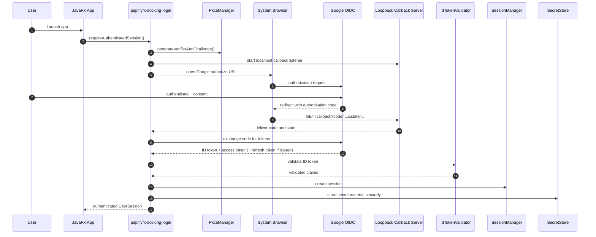
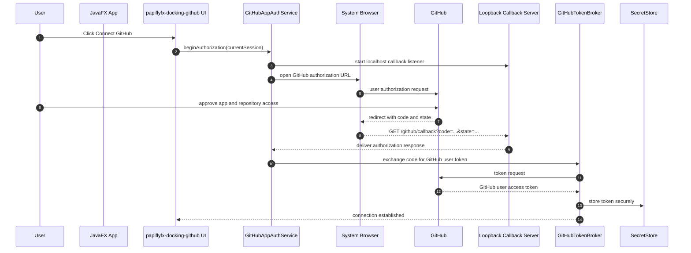
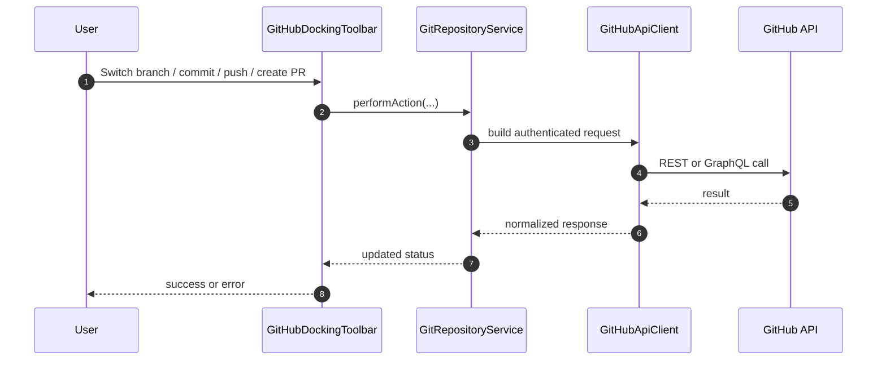

# PapiflyFX Docking Login + GitHub Integration Specification

**Document name:** `papiflyfx-docking-login-github-integration.md`  
**Status:** Draft design specification  
**Target modules:** `papiflyfx-docking-login`, `papiflyfx-docking-github`  
**Platform:** JavaFX desktop application with JPMS modules  
**Date:** March 31, 2026

---

## 1. Purpose

This specification defines how to integrate a login module and a GitHub integration module within the PapiflyFX docking framework.

The design uses:

- **Google OpenID Connect (OIDC)** for user authentication
- **GitHub App user authorization** for GitHub resource access
- **PKCE + loopback redirect** for desktop-friendly browser-based authorization flows
- **Secure secret storage** for refresh tokens and GitHub user access tokens
- **Event-driven communication** between docking modules

This separation matches the protocol boundaries:

- Google proves **who the user is** via OIDC. citeturn838794search0turn838794search8
- GitHub authorizes **what the app may do on GitHub** using GitHub App or OAuth-based flows. GitHub recommends GitHub Apps over OAuth apps because GitHub Apps use fine-grained permissions and short-lived tokens. citeturn838794search1turn838794search5turn838794search9

---

## 2. Goals

### 2.1 Functional goals

The integrated solution shall support:

- Desktop sign-in with Google
- App session creation and restoration
- Secure session secret storage
- Connecting a GitHub account to the signed-in application user
- Displaying GitHub repository information in a docking toolbar
- Viewing the current repository and current branch
- Switching branches
- Creating new branches
- Committing changes
- Preventing commits directly to protected default branches by local policy
- Rolling back the last commit
- Pushing changes to the remote repository
- Creating pull requests

### 2.2 Non-functional goals

The solution shall be:

- modular
- secure by default
- extensible to additional identity providers
- extensible to additional resource providers
- suitable for desktop JavaFX usage
- aligned with official Google and GitHub guidance

---

## 3. Non-goals

This design does not attempt to:

- use Google-issued tokens to call GitHub APIs directly
- merge Google and GitHub identities into a single external identity domain
- replace local git entirely if the application chooses to support local repository operations
- define a complete persistence schema for every future provider
- provide enterprise SSO federation for arbitrary providers beyond the initial Google implementation

---

## 4. Background and protocol model

### 4.1 Why Google OIDC for login

Google’s OIDC implementation is intended for authentication and returns identity information through an ID token. Google’s OAuth 2.0 documentation distinguishes general authorization from OpenID Connect authentication. citeturn838794search0turn838794search4

### 4.2 Why GitHub App authorization for GitHub resources

GitHub documentation states that GitHub Apps are generally preferred over OAuth apps because they offer more granular permissions, more repository-level control, and short-lived tokens. GitHub Apps can also authenticate on behalf of a user with a user access token. citeturn838794search1turn838794search2turn838794search6

### 4.3 Identity-provider vs resource-provider boundary

PapiflyFX should treat these concerns separately:

- **Identity provider**: authenticates a human user into the desktop application
- **Resource provider**: authorizes access to a provider-owned API and resources

Therefore:

- `papiflyfx-docking-login` owns Google sign-in
- `papiflyfx-docking-github` owns GitHub authorization and GitHub API operations
- the bridge between the two is the application’s **internal user session**

---

## 5. Recommended architecture

```text
papiflyfx-docking-login
 ├─ GoogleOIDCProvider
 ├─ AuthBrowserLauncher
 ├─ LoopbackCallbackServer
 ├─ PkceManager
 ├─ IdTokenValidator
 ├─ SessionManager
 ├─ SecretStore
 └─ UserIdentityContext

papiflyfx-docking-github
 ├─ GitHubConnectionController
 ├─ GitHubAppAuthService
 ├─ GitHubTokenBroker
 ├─ GitHubApiClient
 ├─ GitRepositoryService
 ├─ BranchService
 ├─ CommitService
 ├─ PullRequestService
 └─ GitHubDockingToolbar
```

### 5.1 Responsibility split

#### `papiflyfx-docking-login`

Responsibilities:

- start Google OIDC sign-in
- open the system browser
- manage PKCE values and anti-CSRF state
- receive the redirect using a loopback listener
- exchange authorization code for tokens
- validate the ID token
- create and persist the local authenticated session
- expose current session state to other modules

#### `papiflyfx-docking-github`

Responsibilities:

- present “Connect GitHub” action
- initiate GitHub App user authorization
- receive GitHub callback
- exchange code for a GitHub user token
- store the GitHub token securely
- call GitHub REST or GraphQL APIs
- present repository/branch/commit/push/PR UI

---

## 6. High-level flow

```text
[User]
   ↓
(1) Sign in with Google (OIDC)
   ↓
[App creates authenticated UserSession]
   ↓
(2) Connect GitHub account (GitHub App user authorization)
   ↓
[App stores GitHub user token linked to UserSession]
   ↓
(3) GitHub module performs repository actions
```

Important rule:

> Google identity tokens must not be used as GitHub API credentials.

GitHub API operations must always use GitHub-issued tokens with the required scopes or permissions. citeturn838794search2turn838794search10

---

## 7. Sequence diagrams

### 7.1 Sequence A — Desktop sign-in with Google OIDC



Google documents OIDC for authentication and provides OAuth guidance for desktop apps. citeturn838794search0turn838794search8

### 7.2 Sequence B — Connect GitHub account



GitHub documents user access tokens for GitHub Apps and recommends sending them in the `Authorization` header of subsequent API calls. citeturn838794search2turn838794search6

### 7.3 Sequence C — Modify repository state



---

## 8. JavaFX module structure

### 8.1 JPMS module: `papiflyfx.docking.login`

```java
module papiflyfx.docking.login {
    requires javafx.controls;
    requires javafx.graphics;
    requires java.net.http;
    requires java.desktop;
    requires java.sql;
    requires com.fasterxml.jackson.databind;

    exports org.metalib.papiflyfx.docking.login.api;
    exports org.metalib.papiflyfx.docking.login.model;

    uses org.metalib.papiflyfx.docking.login.api.IdentityProvider;
    uses org.metalib.papiflyfx.docking.login.api.SecretStore;
}
```

### 8.2 JPMS module: `papiflyfx.docking.github`

```java
module papiflyfx.docking.github {
    requires javafx.controls;
    requires javafx.graphics;
    requires java.net.http;
    requires java.desktop;
    requires com.fasterxml.jackson.databind;

    requires papiflyfx.docking.login;

    exports org.metalib.papiflyfx.docking.github.api;
    exports org.metalib.papiflyfx.docking.github.model;

    uses org.metalib.papiflyfx.docking.login.api.SessionManager;
    uses org.metalib.papiflyfx.docking.github.api.GitHubProvider;
}
```

---

## 9. Package layout

### 9.1 `papiflyfx-docking-login`

```text
org.metalib.papiflyfx.docking.login
├─ api
│  ├─ IdentityProvider.java
│  ├─ SessionManager.java
│  ├─ SecretStore.java
│  └─ AuthEventListener.java
├─ google
│  ├─ GoogleOidcProvider.java
│  ├─ GoogleDiscoveryClient.java
│  ├─ GoogleTokenClient.java
│  └─ GoogleUserInfoClient.java
├─ internal.pkce
│  ├─ PkceManager.java
│  └─ StateNonceManager.java
├─ internal.callback
│  ├─ LoopbackCallbackServer.java
│  └─ CallbackRequestHandler.java
├─ internal.validation
│  ├─ IdTokenValidator.java
│  └─ JwtKeySetResolver.java
├─ internal.session
│  ├─ DefaultSessionManager.java
│  ├─ UserSession.java
│  └─ UserIdentityContext.java
├─ internal.secret
│  ├─ OsKeychainSecretStore.java
│  └─ EncryptedFileFallbackSecretStore.java
└─ ui
   ├─ LoginDockNode.java
   ├─ LoginToolbarItem.java
   └─ SignInDialogController.java
```

### 9.2 `papiflyfx-docking-github`

```text
org.metalib.papiflyfx.docking.github
├─ api
│  ├─ GitHubProvider.java
│  ├─ GitRepositoryService.java
│  └─ GitHubEventListener.java
├─ auth
│  ├─ GitHubAppAuthService.java
│  ├─ GitHubTokenBroker.java
│  ├─ GitHubAuthorizationStateStore.java
│  └─ GitHubCallbackController.java
├─ client
│  ├─ GitHubApiClient.java
│  ├─ RestRequestFactory.java
│  └─ GraphQlClient.java
├─ service
│  ├─ DefaultGitRepositoryService.java
│  ├─ BranchService.java
│  ├─ CommitService.java
│  ├─ PushService.java
│  └─ PullRequestService.java
├─ model
│  ├─ RepoContext.java
│  ├─ RepositoryRef.java
│  ├─ BranchRef.java
│  ├─ CommitRequest.java
│  └─ PullRequestRequest.java
└─ ui
   ├─ GitHubDockingToolbar.java
   ├─ GitHubRepoSelector.java
   ├─ BranchSwitcherPane.java
   ├─ CommitPane.java
   └─ PullRequestPane.java
```

---

## 10. Core interfaces

### 10.1 Login module API

```java
public interface IdentityProvider {
    AuthResult authenticate(AuthRequest request) throws AuthException;
    void signOut() throws AuthException;
    boolean supportsRefresh();
    TokenSet refresh(TokenSet current) throws AuthException;
}

public interface SessionManager {
    Optional<UserSession> currentSession();
    UserSession requireSession();
    void saveSession(UserSession session);
    void clearSession();
}

public interface SecretStore {
    void put(String key, byte[] secret) throws SecretStoreException;
    Optional<byte[]> get(String key) throws SecretStoreException;
    void remove(String key) throws SecretStoreException;
}
```

### 10.2 GitHub module API

```java
public interface GitHubProvider {
    GitHubConnection connect(UserSession session) throws GitHubAuthException;
    void disconnect(String accountId) throws GitHubAuthException;
    List<RepositoryRef> listRepositories(GitHubConnection connection) throws GitHubApiException;
}

public interface GitRepositoryService {
    BranchRef checkoutBranch(RepoContext repo, String branchName) throws GitHubApiException;
    BranchRef createBranch(RepoContext repo, String newBranch, String fromBranch) throws GitHubApiException;
    CommitResult commitChanges(RepoContext repo, CommitRequest request) throws GitHubApiException;
    PushResult push(RepoContext repo, String branchName) throws GitHubApiException;
    PullRequestRef createPullRequest(RepoContext repo, PullRequestRequest request) throws GitHubApiException;
}
```

---

## 11. UI design in the docking framework

### 11.1 Login dock item

The login module shall provide a dockable login surface with:

- Sign in with Google action
- current authentication state
- signed-in user avatar or placeholder
- signed-in email address
- session restoration status
- sign-out action

### 11.2 GitHub toolbar

The GitHub module shall provide a top or bottom toolbar that can show:

- repository link
- connected GitHub account badge
- current branch
- branch switch action
- create branch action
- commit action
- rollback action
- push action
- create PR action

### 11.3 Optional supporting panes

Optional panes may include:

- repository selector pane
- changed files pane
- staged changes pane
- pull request editor pane
- operation log pane

---

## 12. State model

### 12.1 Authentication state

```java
enum AuthState {
    SIGNED_OUT,
    SIGNING_IN,
    SIGNED_IN,
    REFRESHING,
    ERROR
}
```

### 12.2 GitHub connection state

```java
enum GitHubConnectionState {
    NOT_CONNECTED,
    CONNECTING,
    CONNECTED,
    TOKEN_EXPIRED,
    ERROR
}
```

### 12.3 Repository operation state

```java
enum RepoOperationState {
    IDLE,
    FETCHING,
    CHECKING_OUT,
    COMMITTING,
    PUSHING,
    CREATING_PR,
    FAILED
}
```

All state should be exposed as JavaFX properties so UI controls can bind enabled/disabled states and status indicators.

---

## 13. Security design

### 13.1 Core security rules

The implementation shall:

- use the system browser, not an embedded login webview, for provider sign-in
- use anti-CSRF `state` values
- use PKCE in browser-based authorization flows where applicable
- validate Google ID token issuer, audience, expiration, and subject
- store sensitive tokens using OS-native secret storage where possible
- encrypt fallback file-based storage when OS secure storage is unavailable
- avoid long-lived broad GitHub credentials where a GitHub App token can be used instead

GitHub and Google both document secure token usage and recommend using proper OAuth-based credentials rather than passwords. GitHub also documents that API calls must use a token with the required scopes or permissions. citeturn838794search2turn838794search10turn838794search16

### 13.2 Secret material to persist securely

Examples:

- Google refresh token, if issued and if session restoration is enabled
- GitHub App user access token
- transient PKCE verifier until callback completion
- anti-CSRF `state` value until callback completion

### 13.3 Suggested secret keys

```text
login/google/<google-sub>/refresh-token
github/<google-sub>/<github-account-id>/user-token
github/<google-sub>/last-selected-repo
```

---

## 14. Desktop authorization flow details

### 14.1 Browser launch strategy

The desktop application should:

1. open the authorization URL in the system browser
2. start a loopback listener on `127.0.0.1`
3. receive the callback from the browser
4. display success/failure response locally
5. close or stop the loopback listener after completion

Google documents OAuth 2.0 flows for desktop apps. citeturn838794search8

### 14.2 Why loopback callback is appropriate

A loopback callback:

- avoids embedding credentials in the JavaFX process UI
- fits browser-based desktop authorization
- keeps the flow simple for Google and GitHub providers

---

## 15. GitHub permission model

For the requested repository actions, the GitHub module should plan for at least:

- repository contents: read/write
- pull requests: read/write
- metadata: read
- optionally issues: read/write
- optionally workflows-related permission when modifying workflow-related resources

If an OAuth app is used instead of a GitHub App, scopes must be selected explicitly. GitHub documents scopes such as `repo` and `workflow`, and notes that scopes limit access but do not grant permissions beyond what the user already has. citeturn838794search3turn838794search14

Because GitHub Apps are preferred and support more fine-grained permissions, this specification recommends GitHub Apps first. citeturn838794search1turn838794search9

---

## 16. Operation flows

### 16.1 Switch branch

1. user selects repository
2. module loads available branches
3. user chooses branch
4. module performs checkout or remote selection logic
5. toolbar refreshes current branch label

### 16.2 Create branch

1. validate source branch
2. validate new branch name
3. create branch from selected base
4. switch to the new branch
5. refresh status

### 16.3 Commit changes

1. detect changed files
2. validate commit message
3. prevent direct commit to protected default branch by local policy
4. create commit request
5. refresh repository status

### 16.4 Roll back last commit

1. verify branch is allowed for rollback
2. show warning summary to user
3. perform revert or reset strategy selected by implementation
4. refresh status

### 16.5 Push

1. validate upstream or remote target
2. send authenticated request
3. display push result

### 16.6 Create pull request

1. collect base branch, head branch, title, and body
2. validate head and base differ
3. send PR creation request
4. display resulting PR URL

---

## 17. Module integration contract

### 17.1 Event bus model

The login module shall publish authentication events.

```java
public sealed interface AuthEvent permits SignedIn, SignedOut, TokenRefreshed, AuthFailed {}

public record SignedIn(UserSession session) implements AuthEvent {}
public record SignedOut(String reason) implements AuthEvent {}
public record TokenRefreshed(UserSession session) implements AuthEvent {}
public record AuthFailed(Throwable error) implements AuthEvent {}
```

### 17.2 GitHub module behavior on login events

- on `SignedIn`: enable “Connect GitHub” and restore linked GitHub state if available
- on `SignedOut`: clear GitHub UI state and in-memory connection state
- on `TokenRefreshed`: keep GitHub state unless app-level policy requires revalidation
- on `AuthFailed`: show non-blocking warning and keep repository actions disabled until resolved

---

## 18. Domain model

### 18.1 `UserSession`

```java
public final class UserSession {
    private final String sessionId;
    private final String providerId;
    private final String subject;
    private final String email;
    private final String displayName;
    private final Instant authenticatedAt;
    private final Instant expiresAt;
}
```

### 18.2 `GitHubConnection`

```java
public final class GitHubConnection {
    private final String githubAccountId;
    private final String login;
    private final GitHubConnectionState state;
    private final Set<String> grantedPermissions;
}
```

### 18.3 `RepoContext`

```java
public final class RepoContext {
    private final String owner;
    private final String repository;
    private final String currentBranch;
    private final boolean defaultBranchProtected;
}
```

---

## 19. Error handling requirements

The implementation shall provide explicit handling for:

- browser launch failure
- callback timeout
- invalid state parameter
- PKCE mismatch or token exchange failure
- invalid or expired Google ID token
- GitHub authorization denial
- expired GitHub token
- insufficient GitHub permissions
- repository not found or inaccessible
- branch conflict
- push rejection
- PR creation failure

Errors shall be surfaced in the UI with:

- short human-readable summary
- optional technical detail expansion
- retry action where appropriate

---

## 20. Extensibility model

The architecture should support future providers by keeping abstractions generic.

Examples:

- additional identity providers: Apple, Microsoft, GitHub login, Okta
- additional resource providers: GitLab, Bitbucket, Google Drive, Dropbox

Recommended abstraction boundary:

```java
interface IdentityProvider {
    AuthResult authenticate(AuthRequest request) throws AuthException;
}

interface ResourceProvider {
    AuthorizationResult authorize(UserSession session) throws AuthorizationException;
}
```

This allows PapiflyFX to treat login and provider-owned resource access as separate but composable concerns.

---

## 21. Bootstrap example

```java
public final class DockingAppBootstrap {
    public static void main(String[] args) {
        SecretStore secretStore = new OsKeychainSecretStore();
        SessionManager sessionManager = new DefaultSessionManager(secretStore);

        IdentityProvider googleProvider =
            new GoogleOidcProvider(sessionManager, secretStore);

        GitHubProvider gitHubProvider =
            new DefaultGitHubProvider(sessionManager, secretStore);

        LoginDockNode loginNode = new LoginDockNode(googleProvider, sessionManager);
        GitHubDockingToolbar githubToolbar =
            new GitHubDockingToolbar(gitHubProvider, sessionManager);

        // Register dock nodes into PapiflyFX docking host.
        // dockingHost.add(loginNode);
        // dockingHost.add(githubToolbar);
    }
}
```

---

## 22. Acceptance criteria

### 22.1 Login module acceptance criteria

- user can sign in with Google from the JavaFX app
- Google callback completes successfully through a loopback listener
- ID token is validated before session creation
- session information is available to dependent modules
- sign-out clears local session state and related cached secrets as configured

### 22.2 GitHub module acceptance criteria

- signed-in user can connect a GitHub account
- GitHub authorization completes through the system browser and callback listener
- GitHub token is stored securely
- toolbar shows repository and current branch information
- user can switch branches
- user can create a new branch
- user can commit changes subject to local branch protection policy
- user can roll back the last commit
- user can push changes
- user can create a pull request

### 22.3 Security acceptance criteria

- no provider login form is embedded directly in the JavaFX app
- anti-CSRF state is generated and validated
- PKCE is used where supported by the flow
- secrets are not persisted in plain text
- GitHub access uses GitHub-issued tokens only

---

## 23. Recommended implementation decision

For new PapiflyFX development, the recommended baseline is:

- `papiflyfx-docking-login` uses **Google OIDC**
- `papiflyfx-docking-github` uses **GitHub App user authorization**
- modules communicate through a shared internal `UserSession`
- all provider tokens are stored using secure secret storage

This approach aligns well with Google’s authentication model and GitHub’s recommendation to prefer GitHub Apps over OAuth apps. citeturn838794search0turn838794search1turn838794search2

---

## 24. Final design rule

> **Identity providers authenticate users. Resource providers authorize access to provider-owned resources.**

Applied to PapiflyFX:

- Google belongs in `papiflyfx-docking-login`
- GitHub resource operations belong in `papiflyfx-docking-github`
- `UserSession` is the internal bridge between them

This keeps the design secure, modular, and extensible.

---

## 25. References

1. Google, **OpenID Connect**. citeturn838794search0
2. Google, **Using OAuth 2.0 to Access Google APIs**. citeturn838794search4
3. Google, **OAuth 2.0 for iOS & Desktop Apps**. citeturn838794search8
4. GitHub Docs, **Differences between GitHub Apps and OAuth apps**. citeturn838794search1
5. GitHub Docs, **Authenticating with a GitHub App on behalf of a user**. citeturn838794search2
6. GitHub Docs, **About authentication with a GitHub App**. citeturn838794search6
7. GitHub Docs, **Scopes for OAuth apps**. citeturn838794search3
8. GitHub Docs, **Authenticating to the REST API**. citeturn838794search10
9. GitHub Docs, **Best practices for creating an OAuth app**. citeturn838794search16
